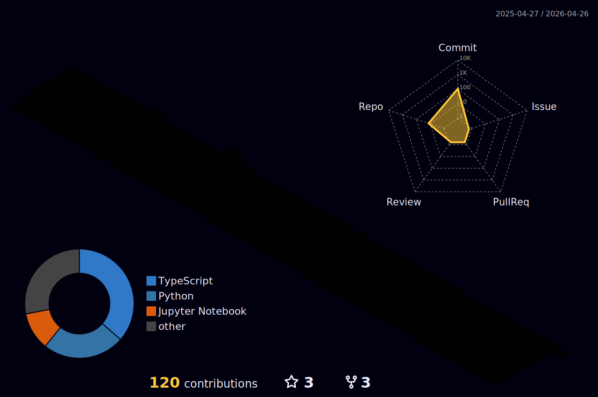

<!-- Responsive Header Banner -->
<picture>
  <source media="(max-width: 768px)" srcset="https://capsule-render.vercel.app/api?type=waving&color=gradient&customColorList=2,3,12,19,21&height=180&section=header&text=Vijay%20Andem&fontSize=36&animation=fadeIn&fontAlignY=38&desc=Data%20Analyst%20%7C%20Gen%20AI%20Architect%20%7C%20BI%20Professional&descAlignY=62&descAlign=50&descSize=12&fontColor=ffffff">
  <source media="(max-width: 1024px)" srcset="https://capsule-render.vercel.app/api?type=waving&color=gradient&customColorList=2,3,12,19,21&height=200&section=header&text=Vijay%20Andem&fontSize=50&animation=fadeIn&fontAlignY=36&desc=Data%20Analyst%20%7C%20Gen%20AI%20Architect%20%7C%20BI%20Professional&descAlignY=58&descAlign=50&descSize=16&fontColor=ffffff">
  
</picture>

<!-- Typing Animation -->

 

**Data Analyst and Gen AI Architect based in India, building intelligent systems that turn raw data into business decisions.**

---

## About Me

I work at the intersection of data analytics, business intelligence, and generative AI. My day-to-day involves building Power BI and Tableau dashboards that surface actionable insights, developing LLM-powered applications using LangChain and RAG architectures, and deploying AI agents that automate analytical workflows.

I focus on practical applications -- from interactive Streamlit dashboards for stakeholder reporting to local-first AI solutions using Ollama for privacy-sensitive environments. I believe in turning complex datasets into clear, compelling stories that drive business decisions.

---

## Tools and Technologies

  

---

## Featured Projects

### [MCP Data Analysis Toolkit](https://github.com/And3m/mcp-data-analysis-toolkit)

Model Context Protocol server for AI-powered data analysis. Enables LLM agents to discover and execute data processing tools through a standardized protocol interface.

`Python` `MCP` `AI Agents` `LLMs` `Protocol Buffers`

---

### [Interactive AI Chat Agent](https://github.com/And3m/chainlit-ollama-interactive-agent)

Locally-hosted conversational AI with real-time system monitoring, 2048-token responses, and built-in analytics commands. Runs 100% on-device with no external API dependencies.

`Python` `Chainlit` `Ollama` `Llama 3.2` `Real-time Analytics`

---

### [Coffee Shop Sales Dashboard](https://github.com/And3m/Coffee-Shop-Sales-Analysis-Dashboard-Streamlit-Pandas-Plotly) &nbsp; 

Interactive Streamlit dashboard with KPIs, trend analysis, and Plotly visualizations for coffee shop sales performance.

`Streamlit` `Pandas` `Plotly` `Python`

---

### [Restaurant Ratings Analysis](https://github.com/And3m/Restaurant-Ratings-Analysis-PowerBI)

5-page Power BI dashboard exploring restaurant distribution across Mexico, consumer behavior patterns, and rating trends with geographic analysis.

`Power BI` `DAX` `Power Query` `Data Modeling`

---

### [LangChain Playbook](https://github.com/And3m/Langchain_playbook)

Comprehensive tutorial collection covering LangChain fundamentals through advanced implementations -- chatbots, RAG systems, agents, and vector database integrations.

`Python` `LangChain` `OpenAI` `RAG` `Vector Databases`

---

## GitHub Analytics

<picture>
  <source media="(prefers-color-scheme: dark)" srcset="https://github-readme-stats.vercel.app/api?username=And3m&show_icons=true&theme=github_dark_dimmed&include_all_commits=true&count_private=true" />
  <source media="(prefers-color-scheme: light)" srcset="https://github-readme-stats.vercel.app/api?username=And3m&show_icons=true&theme=default&include_all_commits=true&count_private=true" />
  
</picture>
&nbsp;
<picture>
  <source media="(prefers-color-scheme: dark)" srcset="https://github-readme-stats.vercel.app/api/top-langs/?username=And3m&layout=compact&langs_count=8&theme=github_dark_dimmed" />
  <source media="(prefers-color-scheme: light)" srcset="https://github-readme-stats.vercel.app/api/top-langs/?username=And3m&layout=compact&langs_count=8&theme=default" />
  
</picture>

  

<picture>
  <source media="(prefers-color-scheme: dark)" srcset="https://streak-stats.demolab.com?user=And3m&theme=github-dark-blue" />
  <source media="(prefers-color-scheme: light)" srcset="https://streak-stats.demolab.com?user=And3m&theme=default" />
  
</picture>

  

<!-- 3D Contribution Calendar (generated by GitHub Action) -->
<picture>
  <source media="(prefers-color-scheme: dark)" srcset="./profile-3d-contrib/profile-night-rainbow.svg" />
  <source media="(prefers-color-scheme: light)" srcset="./profile-3d-contrib/profile-green-animate.svg" />
  
</picture>

---

<!-- Snake Animation -->
<picture>
  <source media="(prefers-color-scheme: dark)" srcset="https://github.com/And3m/And3m/blob/output/github-contribution-grid-snake-dark.svg" />
  <source media="(prefers-color-scheme: light)" srcset="https://github.com/And3m/And3m/blob/output/github-contribution-grid-snake.svg" />
  
</picture>

