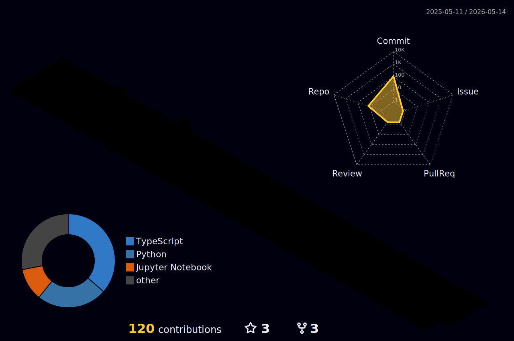

<!-- Custom Animated SVG Header -->

<!-- Typing Animation -->

 

**Data Analyst and Gen AI Architect based in India, building intelligent systems that turn raw data into business decisions.**

---

<!-- Bento Grid Layout -->
<table>
<tr>
<td width="60%" valign="top">

## About Me

I work at the intersection of data analytics, business intelligence, and generative AI. My day-to-day involves building Power BI and Tableau dashboards that surface actionable insights, developing LLM-powered applications using LangChain and RAG architectures, and deploying AI agents that automate analytical workflows.

I focus on practical applications -- from interactive Streamlit dashboards for stakeholder reporting to local-first AI solutions using Ollama for privacy-sensitive environments. I believe in turning complex datasets into clear, compelling stories that drive business decisions.

</td>
<td width="40%" valign="top">

## Now Playing

<!-- Replace YOUR_SPOTIFY_USER_ID with your Spotify user ID -->
<!-- Setup: Visit spotify-github-profile.kittinanx.com, log in with Spotify, and get your user ID -->

 

<!-- Daily Quote -->

</td>
</tr>
</table>

---

## Tools and Technologies

&nbsp;&nbsp;
&nbsp;&nbsp;
&nbsp;&nbsp;
&nbsp;&nbsp;
&nbsp;&nbsp;
&nbsp;&nbsp;
&nbsp;&nbsp;
&nbsp;&nbsp;
&nbsp;&nbsp;
&nbsp;&nbsp;
&nbsp;&nbsp;
&nbsp;&nbsp;
&nbsp;&nbsp;
&nbsp;&nbsp;

  

---

## Featured Projects

<strong>AI/ML & LLM Applications</strong>

 

### [MCP Data Analysis Toolkit](https://github.com/And3m/mcp-data-analysis-toolkit)

Model Context Protocol server for AI-powered data analysis. Enables LLM agents to discover and execute data processing tools through a standardized protocol interface.

`Python` `MCP` `AI Agents` `LLMs` `Protocol Buffers`

### [Interactive AI Chat Agent](https://github.com/And3m/chainlit-ollama-interactive-agent)

Locally-hosted conversational AI with real-time system monitoring, 2048-token responses, and built-in analytics commands. Runs 100% on-device with no external API dependencies.

`Python` `Chainlit` `Ollama` `Llama 3.2` `Real-time Analytics`

### [LangChain Playbook](https://github.com/And3m/Langchain_playbook)

Comprehensive tutorial collection covering LangChain fundamentals through advanced implementations -- chatbots, RAG systems, agents, and vector database integrations.

`Python` `LangChain` `OpenAI` `RAG` `Vector Databases`

<strong>Data Analytics & Visualization</strong>

 

### [Coffee Shop Sales Dashboard](https://github.com/And3m/Coffee-Shop-Sales-Analysis-Dashboard-Streamlit-Pandas-Plotly) &nbsp; 

Interactive Streamlit dashboard with KPIs, trend analysis, and Plotly visualizations for coffee shop sales performance.

`Streamlit` `Pandas` `Plotly` `Python`

### [Restaurant Ratings Analysis](https://github.com/And3m/Restaurant-Ratings-Analysis-PowerBI)

5-page Power BI dashboard exploring restaurant distribution across Mexico, consumer behavior patterns, and rating trends with geographic analysis.

`Power BI` `DAX` `Power Query` `Data Modeling`

---

## GitHub Analytics

<!-- Activity Graph -->
<picture>
  <source media="(prefers-color-scheme: dark)" srcset="https://github-readme-activity-graph.vercel.app/graph?username=And3m&theme=github-dark-dimmed&area=true&hide_border=true&custom_title=Contribution%20Activity" />
  <source media="(prefers-color-scheme: light)" srcset="https://github-readme-activity-graph.vercel.app/graph?username=And3m&theme=github-light&area=true&hide_border=true&custom_title=Contribution%20Activity" />
  
</picture>

 

<!-- Stats Cards -->
<table>
<tr>
<td width="50%" align="center">
<picture>
  <source media="(prefers-color-scheme: dark)" srcset="https://github-readme-stats.vercel.app/api?username=And3m&show_icons=true&theme=github_dark_dimmed&include_all_commits=true&count_private=true&hide_border=true" />
  <source media="(prefers-color-scheme: light)" srcset="https://github-readme-stats.vercel.app/api?username=And3m&show_icons=true&theme=default&include_all_commits=true&count_private=true&hide_border=true" />
  
</picture>
</td>
<td width="50%" align="center">
<picture>
  <source media="(prefers-color-scheme: dark)" srcset="https://github-readme-stats.vercel.app/api/top-langs/?username=And3m&layout=compact&langs_count=8&theme=github_dark_dimmed&hide_border=true" />
  <source media="(prefers-color-scheme: light)" srcset="https://github-readme-stats.vercel.app/api/top-langs/?username=And3m&layout=compact&langs_count=8&theme=default&hide_border=true" />
  
</picture>
</td>
</tr>
</table>

<!-- Streak -->
<picture>
  <source media="(prefers-color-scheme: dark)" srcset="https://streak-stats.demolab.com?user=And3m&theme=github-dark-blue&hide_border=true" />
  <source media="(prefers-color-scheme: light)" srcset="https://streak-stats.demolab.com?user=And3m&theme=default&hide_border=true" />
  
</picture>

  

<!-- 3D Contribution Calendar -->
<picture>
  <source media="(prefers-color-scheme: dark)" srcset="./profile-3d-contrib/profile-night-rainbow.svg" />
  <source media="(prefers-color-scheme: light)" srcset="./profile-3d-contrib/profile-green-animate.svg" />
  
</picture>

---

## Latest Blog Posts

<!-- BLOG-POST-LIST:START -->
<!-- BLOG-POST-LIST:END -->

<!-- Setup: Update .github/workflows/blog-posts.yml with your blog RSS feed URL -->

---

<!-- Daily Dev Quote -->
<picture>
  <source media="(prefers-color-scheme: dark)" srcset="https://quotes-github-readme.vercel.app/api?type=horizontal&theme=dark&border=true" />
  <source media="(prefers-color-scheme: light)" srcset="https://quotes-github-readme.vercel.app/api?type=horizontal&theme=light&border=true" />
  
</picture>

  

<!-- Snake Animation -->
<picture>
  <source media="(prefers-color-scheme: dark)" srcset="https://github.com/And3m/And3m/blob/output/github-contribution-grid-snake-dark.svg" />
  <source media="(prefers-color-scheme: light)" srcset="https://github.com/And3m/And3m/blob/output/github-contribution-grid-snake.svg" />
  
</picture>

