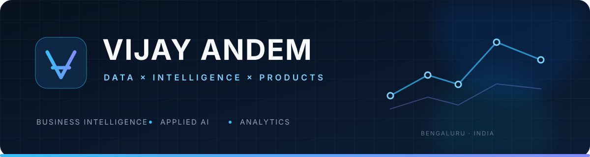

<picture>
  <source media="(prefers-color-scheme: dark)" srcset="./assets/profile-header-dark.svg">
  <source media="(prefers-color-scheme: light)" srcset="./assets/profile-header-light.svg">
  
</picture>

### Building decision systems at the intersection of data, business intelligence, and generative AI.

Senior BI & Data Analyst · GenAI Applications · Bengaluru, India

[**Portfolio**](https://vijayandem.vercel.app) &nbsp;·&nbsp;
[**LinkedIn**](https://www.linkedin.com/in/vijay-andem-b2092223/) &nbsp;·&nbsp;
[**Email**](mailto:vijayandem@gmail.com) &nbsp;·&nbsp;
[**X**](https://x.com/vjandem)

---

## Hello, I'm Vijay.

I turn complex data into reporting, applications, and AI-assisted workflows that people can actually use. Over 13 years across FMCG, IT services, and healthcare consulting, I have worked across the full analytics lifecycle—from SQL and Python pipelines to executive dashboards and stakeholder decisions.

Today, I am extending that experience into practical generative AI: RAG applications, analytical agents, evaluation workflows, and local-first tools for privacy-sensitive environments.

> **My focus:** useful intelligence over impressive demos—systems that make analysis faster, clearer, and easier to act on.

## Currently

- **Building** practical AI agents and data applications for analysts and business teams.
- **Exploring** reliable RAG, evaluation, multimodal document intelligence, and the Model Context Protocol.
- **Open to** senior opportunities and collaborations across business intelligence, analytics, and applied AI.

## Selected work

01 · APPLIED GENERATIVE AI

### [GenAI for Analysts ↗](https://github.com/And3m/genai-for-analysts)

A ten-project portfolio that translates LLM concepts into real analytical workflows—from RAG and agentic systems to fine-tuning, evaluation, and multimodal document intelligence.

`Python` `LangChain` `LangGraph` `LlamaIndex` `ChromaDB` `Streamlit`

---

02 · AGENT INFRASTRUCTURE

### [MCP Data Analysis Toolkit ↗](https://github.com/And3m/mcp-data-analysis-toolkit)

A Model Context Protocol server that gives AI agents a standardized way to discover and execute data-processing tools.

`Python` `MCP` `AI Agents` `LLMs`

---

03 · LOCAL-FIRST AI

### [Interactive AI Chat Agent ↗](https://github.com/And3m/chainlit-ollama-interactive-agent)

A private, locally hosted conversational agent with real-time system monitoring and built-in analytical commands—without depending on an external model API.

`Python` `Chainlit` `Ollama` `Llama 3.2`

---

04 · ANALYTICS PRODUCT

### [Coffee Shop Sales Dashboard ↗](https://github.com/And3m/Coffee-Shop-Sales-Analysis-Dashboard-Streamlit-Pandas-Plotly)

An interactive sales analytics product with KPI tracking, trend exploration, product drilldowns, and exportable insights for a multi-location coffee business.

`Streamlit` `Pandas` `Plotly` `Python` · [**Live dashboard**](https://coffee-shop-dashboard.streamlit.app)

[Explore more projects →](https://vijayandem.vercel.app)

## What I work with

### AI systems

RAG pipelines, analytical agents, prompt and retrieval design, local LLM applications, multimodal workflows, and evaluation.

`LangChain` `LangGraph` `LlamaIndex` `OpenAI` `Ollama` `ChromaDB`

### Data products

Interactive applications and automated workflows that make complex analysis accessible to non-technical teams.

`Python` `SQL` `Pandas` `Streamlit` `Plotly` `PostgreSQL`

### Business intelligence

Decision-focused dashboards, semantic models, KPI frameworks, and executive reporting built around business questions.

`Power BI` `DAX` `Power Query` `Tableau` `IBM Cognos` `Advanced Excel`

## A few outcomes

- Reduced manual reporting effort by **40%+** through Power BI automation.
- Automated **thousands of recurring data pulls** with Python.
- Delivered **50+ automated reports and dashboards** across enterprise environments.
- Worked across **CavinKare, IBM, Indegene, and Infosys**.

## GitHub activity

<picture>
  <source media="(prefers-color-scheme: dark)" srcset="https://github-readme-stats.vercel.app/api?username=And3m&amp;show_icons=true&amp;hide_border=true&amp;bg_color=00000000&amp;title_color=7dd3fc&amp;text_color=cbd5e1&amp;icon_color=38bdf8&amp;include_all_commits=true">
  <source media="(prefers-color-scheme: light)" srcset="https://github-readme-stats.vercel.app/api?username=And3m&amp;show_icons=true&amp;hide_border=true&amp;bg_color=00000000&amp;title_color=0369a1&amp;text_color=334155&amp;icon_color=0284c7&amp;include_all_commits=true">
  
</picture>

---

### Have a data problem that could become a useful product?

I'm always interested in thoughtful work across analytics, business intelligence, and applied AI.

[**Start a conversation on LinkedIn**](https://www.linkedin.com/in/vijay-andem-b2092223/) &nbsp;·&nbsp; [**Send me an email**](mailto:vijayandem@gmail.com)

Designed with clarity, built around useful work.

