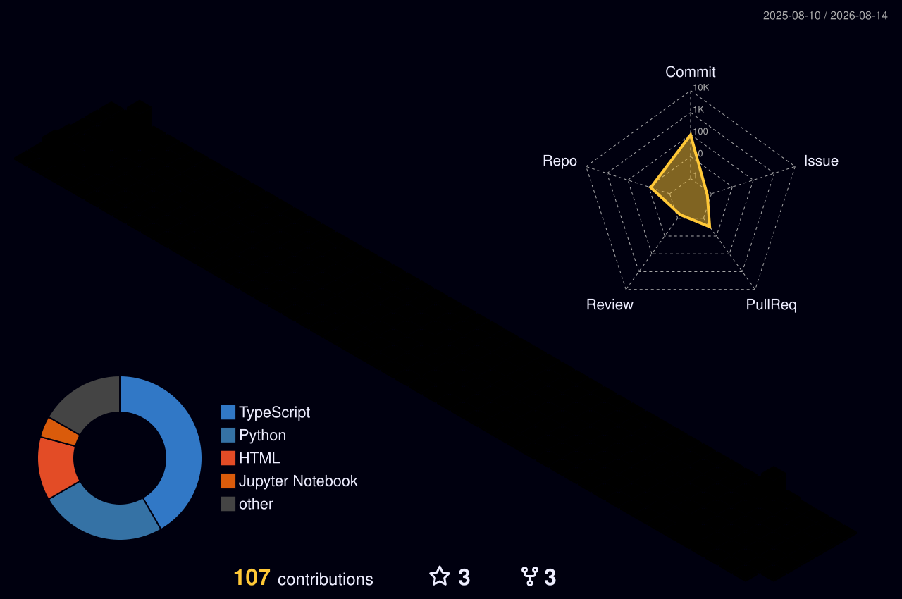

<!-- MAINTENANCE NOTES (invisible on the rendered profile)
  1. NO COMMAS in any srcset= URL. srcset is a comma-separated candidate list, so
     capsule-render's customColorList=2,3,12,19,21 gets truncated to "...=2" and the
     banner breaks on mobile. Use the single-value customColorList=12 (also stops the
     multi-value list picking a random gradient on every page load).
  2. Snake SVGs must come from raw.githubusercontent.com/.../output/, never
     github.com/.../blob/output/ -- blob URLs serve HTML and render broken.
  3. 3D calendar: only profile-night-rainbow.svg and profile-green-animate.svg are
     kept. The prune step in 3d-contrib.yml deletes the other 8 daily, so changing
     the theme here without changing that filter 404s the image.
  4. About Me / Experience / Education mirror the resume -- update together.
     Only badge tools the resume or a linked repo backs.
  5. Social links live in two places: header badge row and footer CTA.
  6. Experience entries use explicit  ; a bare newline collapses in some renderers.
  7. update-readme.yml was deleted -- it needed activity marker comments that were
     never in this file, so it failed daily. Re-add both together or neither.
  8. Blank stats/streak cards are upstream rate-limiting, not a config error.
  Theme: stats github_dark_dimmed | streak github-dark-blue | typing #58A6FF
-->

<!-- Responsive Header Banner. NOTE: no commas in these URLs (see srcset note above). -->
<picture>
  <source media="(max-width: 600px)" srcset="https://capsule-render.vercel.app/api?type=waving&color=gradient&customColorList=12&height=170&section=header&text=Vijay%20Kumar%20Andem&fontSize=34&animation=fadeIn&fontAlignY=38&desc=Senior%20BI%20%26%20Data%20Analyst%20%7C%20GenAI&descAlignY=62&descAlign=50&descSize=16&fontColor=ffffff">
  
</picture>

<!-- Typing Animation -->

 

**Senior business intelligence and data analyst in Bengaluru, India — 13 years turning operational data into reporting that leadership acts on, now extending into applied generative AI.**

**Open to senior roles in business analysis, business intelligence, and AI solutions.**

---

## About Me

Thirteen years across FMCG, IT services, and healthcare consulting — Infosys, Indegene, IBM, and CavinKare. SQL and Python for preparation, Power BI and Tableau for delivery, and the stakeholder conversations that decide what is worth measuring at all.

The through-line is automation: over 40% less manual reporting effort at CavinKare, thousands of weekly data pulls replaced with Python at IBM, 50+ automated reports at Infosys. Since 2024 I have extended that into generative AI — LangChain and RAG applications that let non-technical teams query business data in plain language.

---

## Experience

**Business Analyst** · CavinKare · Mar 2022 — Dec 2023 
Power BI dashboards for campaign performance, budget tracking, and ROI across the personal care portfolio — cut manual reporting effort by over 40%. Analyzed Nielsen and Kantar syndicated data and presented predictive analysis to C-suite stakeholders.

**Marketing Analyst** · IBM · Jul 2016 — Mar 2022 
Global marketing dashboards in Tableau and Cognos across regions. Replaced thousands of recurring weekly data pulls with Python, and built a self-service query app that let non-technical teams retrieve business data without SQL.

**Reporting Analyst** · Indegene · Aug 2015 — May 2016 
Automated marketing and sales performance reporting for Pfizer North America across large multi-source datasets.

**Data Analyst** · Infosys · Mar 2011 — Aug 2015 
50+ automated reports and dashboards in SQL, VBA, and Advanced Excel for the Income Tax Department's Centralized Processing Centre.

---

## Tools and Technologies

  

**Business Intelligence**

**Generative AI**

**Data and Apps**

---

## Featured Projects

### [GenAI for Analysts](https://github.com/And3m/genai-for-analysts)

10-project portfolio demonstrating practical generative AI applications from a business analytics perspective — covering LLM foundations, RAG systems, agentic workflows, fine-tuning, evaluation dashboards, and multimodal document intelligence.

`Python` `LangChain` `LangGraph` `LlamaIndex` `ChromaDB` `Streamlit` `RAG` `AI Agents`

---

### [MCP Data Analysis Toolkit](https://github.com/And3m/mcp-data-analysis-toolkit)

Model Context Protocol server for AI-powered data analysis. Enables LLM agents to discover and execute data processing tools through a standardized protocol interface.

`Python` `MCP` `AI Agents` `LLMs` `Protocol Buffers`

---

### [Interactive AI Chat Agent](https://github.com/And3m/chainlit-ollama-interactive-agent)

Locally-hosted conversational AI with real-time system monitoring, 2048-token responses, and built-in analytics commands. Runs 100% on-device with no external API dependencies.

`Python` `Chainlit` `Ollama` `Llama 3.2` `Real-time Analytics`

---

### [Coffee Shop Sales Dashboard](https://github.com/And3m/Coffee-Shop-Sales-Analysis-Dashboard-Streamlit-Pandas-Plotly) &nbsp; 

Interactive Streamlit dashboard with KPIs, trend analysis, and Plotly visualizations for coffee shop sales performance.

`Streamlit` `Pandas` `Plotly` `Python`

---

### [Restaurant Ratings Analysis](https://github.com/And3m/Restaurant-Ratings-Analysis-PowerBI)

5-page Power BI dashboard exploring restaurant distribution across Mexico, consumer behavior patterns, and rating trends with geographic analysis.

`Power BI` `DAX` `Power Query` `Data Modeling`

---

### [LangChain Playbook](https://github.com/And3m/Langchain_playbook)

Comprehensive tutorial collection covering LangChain fundamentals through advanced implementations — chatbots, RAG systems, agents, and vector database integrations.

`Python` `LangChain` `OpenAI` `RAG` `Vector Databases`

---

**More projects, live dashboards, and write-ups → [vijayandem.vercel.app](https://vijayandem.vercel.app)**

---

## Education and Certifications

**BSc in Mathematics, Statistics, and Computer Science** — Kakatiya University

**IBM** — Applied Data Science with Python (L2) · Machine Learning with Python · Data Science Foundations · Data Analysis and Visualization with Python · Deep Learning Essentials &nbsp;|&nbsp; **Optimizely** — X Web Foundations

---

## GitHub Analytics

<picture>
  <source media="(prefers-color-scheme: dark)" srcset="https://github-readme-stats.vercel.app/api?username=And3m&show_icons=true&theme=github_dark_dimmed&include_all_commits=true&count_private=true" />
  <source media="(prefers-color-scheme: light)" srcset="https://github-readme-stats.vercel.app/api?username=And3m&show_icons=true&theme=default&include_all_commits=true&count_private=true" />
  
</picture>
&nbsp;
<picture>
  <source media="(prefers-color-scheme: dark)" srcset="https://github-readme-stats.vercel.app/api/top-langs/?username=And3m&layout=compact&langs_count=8&theme=github_dark_dimmed" />
  <source media="(prefers-color-scheme: light)" srcset="https://github-readme-stats.vercel.app/api/top-langs/?username=And3m&layout=compact&langs_count=8&theme=default" />
  
</picture>

  

<picture>
  <source media="(prefers-color-scheme: dark)" srcset="https://streak-stats.demolab.com?user=And3m&theme=github-dark-blue" />
  <source media="(prefers-color-scheme: light)" srcset="https://streak-stats.demolab.com?user=And3m&theme=default" />
  
</picture>

  

<!-- 3D Contribution Calendar (generated by GitHub Action) -->
<picture>
  <source media="(prefers-color-scheme: dark)" srcset="./profile-3d-contrib/profile-night-rainbow.svg" />
  <source media="(prefers-color-scheme: light)" srcset="./profile-3d-contrib/profile-green-animate.svg" />
  
</picture>

---

## Let's Talk

Open to senior roles in business analysis, business intelligence, and AI solutions. 
Based in Bengaluru, India — open to remote.

 

<!-- Snake Animation -->
<picture>
  <source media="(prefers-color-scheme: dark)" srcset="https://raw.githubusercontent.com/And3m/And3m/output/github-contribution-grid-snake-dark.svg" />
  <source media="(prefers-color-scheme: light)" srcset="https://raw.githubusercontent.com/And3m/And3m/output/github-contribution-grid-snake.svg" />
  
</picture>

